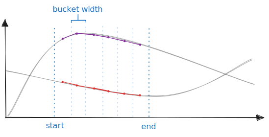

# talna

[](https://github.com/marvin-j97/talna/actions/workflows/test.yml)
[](https://docs.rs/talna)
[](https://crates.io/crates/talna)

[](https://deps.rs/repo/github/marvin-j97/talna)

Ilocano: Peace, Serenity

Icelandic, Old Norse: Numbers

---

A simple, embeddable time series database.

## About

It uses <https://github.com/fjall-rs/fjall> as its underlying storage engine, allowing around ~1M data points per second to be ingested.

With the storage engine being LSM-based, there's no degradation in write ingestion speed (even for datasets much larger than RAM), low write amplification (good for SSDs) and on-disk data is compressed (again, good for SSDs).

## Data model

> The tagging and querying mechanism is modelled after Datadog's metrics service (<https://www.datadoghq.com/blog/engineering/timeseries-indexing-at-scale/>).

A (time) series is a list of data points.

Each data point has

- a nanosecond timestamp, which is also its primary key (big-endian stored negated, because we want to scan from newest to oldest, and forwards scans are faster)
- the actual value (float)
- a tagset (list of key-value pairs, e.g. “service=db; env=prod”)
- a metric name (e.g. “cpu.total”)

A `Database` is contained in a single Fjall `Keyspace` and consists of a couple of partitions (prefixed by `_talna#`). This way it can be integrated in an existing application using Fjall.

Every permutation of { metric, tagsets } is assigned a `SeriesKey`. This maps to a Series ID.

Each series’ tagset is stored in the `Tagsets` partition, used for aggregation.

Lastly, each metric and tag is indexed in an inverted index (`TagIndex`). Queries perform lookups to that index to get a list of series IDs that match a query. This way any query AST can be modelled by simply union-ing or intersecting postings lists of that inverted index.

Data points are f32s by default, but can be switched to f64 using the `high_precision` feature flag.

## Benchmark: 1 billion data points

Hyper mode, jemalloc, i9 11900k, Samsung PM9A3:

```
ingested 1 billion in 769s
write speed: 1300390 writes per second
peak mem: 158 MiB
disk space: 10 GiB
query [1M latest data points] in 197ms
reopened DB in 140ms
```

Run with:

```bash
cd billion
cargo run -r
```

## Basic usage

```rs
use talna::{Database, Duration, MetricName, tagset, timestamp};

let db = Database::builder().open(path)?;

let metric_name = MetricName::try_from("cpu.total").unwrap();

db.write(
    metric_name,
    25.42, // actual value (float)
    tagset!(
        "env" => "prod",
        "service" => "db",
        "host" => "h-1",
    ),
)?;

db.write(
    metric_name,
    42.42, // actual value (float)
    tagset!(
        "env" => "prod",
        "service" => "db",
        "host" => "h-2",
    ),
)?;

let buckets = db
  .avg(metric_name, /* group by tag */ "host")
  .filter("env:prod AND service:db")
  // use .start() and .end() to set the time bounds
  .start(timestamp() - Duration::months(1.0))
  // use .granularity() to set the granularity (bucket width in nanoseconds)
  .granularity(Duration::days(1.0))
  .build()?
  .collect()?;

println!("{buckets:#?}");
```


